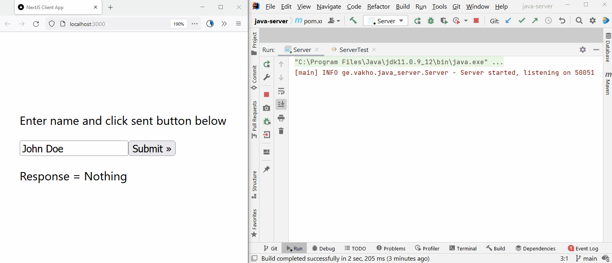

# NextJS and Java Communication using gRPC
An example of communicating with Java from NextJS using gRPC.

# How to build project
The main part is the /proto folder. It contains *.proto file, which is the service contract between gRPC client and gRPC server.

Build the Java project using Maven command: `mvn package` and then run the JAR file (or run it from IntelliJ IDE).

Run the NextJS project using `npm run dev` command.

Don't forget to rebuild the PROTO object whenever you change change your *.proto file in /proto folder. In Java, the generation part is done using the Maven PROTO plugin, but in NextJS, you have to run build-protoc.bat file manually. 

P.S. you must specify full path to plugin applications: `grpc_tools_node_protoc_plugin` and `protoc-gen-ts.cmd`; in `build-protoc.bat file.